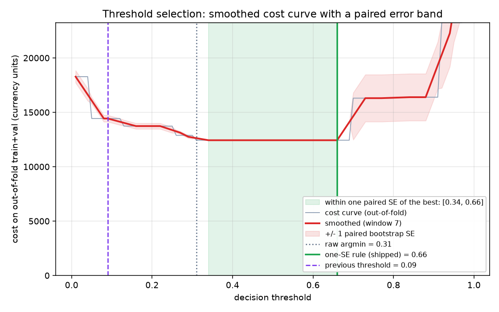

# Class-imbalance experiment

331 frauds against 198,277 legitimate transactions in the training split.
Every arm below uses identical hyperparameters, identical fixed boosting
rounds and no early stopping, so the only thing varying is the imbalance
treatment. Selection is on validation; the test split is used once, at the
end, on the winner only.

## Validation bench

| rank | arm | family | train frauds | val PR-AUC | +/- seed | cost @0.5 | P@0.5 | R@0.5 | what it does |
|---:|---|---|---:|---:|---:|---:|---:|---:|---|
| 1 | `scale_pos_weight` | reweight | 331 | **0.8478** | 0.0048 | 832 | 0.944 | 0.784 | SHIPPED recipe: one constant multiplier on every fraud |
| 2 | `smote` | resample | 1,983 | **0.8455** | 0.0034 | 891 | 0.924 | 0.789 | Chawla et al. interpolation, 6x frauds |
| 3 | `borderline+amount` | combo | 1,983 | **0.8437** | 0.0085 | 796 | 0.959 | 0.770 | best resampler x cost-sensitive weights |
| 4 | `random_oversample` | resample | 1,983 | **0.8415** | 0.0053 | 884 | 0.944 | 0.784 | duplicate frauds - adds no information, the floor for SMOTE |
| 5 | `smote_enn` | resample | 1,971 | **0.8413** | 0.0039 | 884 | 0.924 | 0.793 | SMOTE then clean the interleaved region |
| 6 | `class_weight` | reweight | 331 | **0.8410** | 0.0042 | 941 | 0.927 | 0.775 | inverse frequency as per-row weights instead of spw |
| 7 | `jitter` | resample | 1,983 | **0.8389** | 0.0155 | 881 | 0.924 | 0.798 | noise scaled to minority spread - can leave the fraud hull |
| 8 | `smote_x30` | resample | 9,914 | **0.8361** | 0.0027 | 916 | 0.914 | 0.798 | same, 30x frauds - does more help? |
| 9 | `focal_loss_g1` | loss | 331 | **0.8354** | 0.0038 | 900 | 0.952 | 0.746 | milder focusing, stronger class prior |
| 10 | `focal_loss` | loss | 331 | **0.8351** | 0.0027 | 833 | 0.981 | 0.728 | Lin et al.: gradient concentrates on hard boundary rows |
| 11 | `none` | baseline | 331 | **0.8351** | 0.0006 | 1,672 | 0.987 | 0.737 | no imbalance handling at all - the floor everything must clear |
| 12 | `smote+smoothing` | combo | 1,983 | **0.8338** | 0.0037 | 781 | 1.000 | 0.765 | best resampler x soft targets |
| 13 | `label_smoothing` | targets | 331 | **0.8326** | 0.0047 | 1,504 | 1.000 | 0.714 | spw + soft targets: undisputed fraud is labelled legitimate |
| 14 | `borderline_smote` | resample | 1,983 | **0.8314** | 0.0010 | 1,495 | 0.948 | 0.761 | synthesise only near the decision boundary |
| 15 | `effective_number` | reweight | 331 | **0.8251** | 0.0062 | 987 | 0.970 | 0.756 | Cui et al. class-balanced: discounts redundancy among frauds |
| 16 | `adasyn` | resample | 1,983 | **0.8193** | 0.0052 | 930 | 0.916 | 0.770 | density-adaptive synthesis |
| 17 | `amount_weight` | reweight | 331 | **0.7858** | 0.0090 | 1,437 | 0.972 | 0.657 | COST-SENSITIVE: weight each row by the money it risks |

## Verdict

The shipped scale_pos_weight recipe wins the validation bench outright. Nothing below replaces it.

## The winner, taken to test once

Winner: **`scale_pos_weight`**. Out-of-fold PR-AUC over train+val (0.8478) is the honest selection number.

Calibrator: **isotonic**, fitted on out-of-fold scores. The cost model multiplies predicted probabilities by money, so they have to mean what they say -- and `scale_pos_weight` is itself a distortion of the base rate, exactly like resampling: telling the learner a fraud is worth 600 legitimate rows trains it to report probabilities for a world with 600x more fraud than this one.

| | shipped tuned | imbalance winner |
|---|---:|---:|
| PR-AUC (test) | 0.8061 | 0.8000 |
| operating threshold | 0.09 | 0.66 |
| precision there | 0.7808 | 0.9322 |
| recall there | 0.8028 | 0.7746 |
| false positives | 16 | 4 |
| missed frauds | 14 | 16 |
| cost | 4,038 | 3,679 |
| do nothing | 9,241 | |

Paired bootstrap on PR-AUC: delta -0.0060, 95% CI [-0.0271, +0.0114] -- **not** significant on 71 test frauds.

The ranking did not improve and is not claimed to have. The model is the same recipe; what changed is where the threshold was placed, and that is where the money came from.

## Calibration

Selected on **cross-fitted** ECE. An isotonic fit scored on the same scores it was fitted to reports an ECE of ~0 by construction, so that number is a tautology and is shown next to the honest one rather than instead of it.

| calibrator | ECE (in-sample) | ECE (cross-fitted) | Brier (cross-fitted) |
|---|---:|---:|---:|
| `none` | 0.000125 | 0.000125 | 0.000406 |
| `platt` | 0.000104 | 0.000081 | 0.000391 |
| `isotonic` **<- selected** | 0.000000 | 0.000044 | 0.000392 |

## Threshold stability

Raw argmin of the cost curve: 0.31. Across 200 stratified bootstrap resamples that argmin had an IQR of [0.31, 0.31], a 5-95 range of [0.31, 0.31] and a standard deviation of 0.028, so the raw minimum is not a quantity worth reporting to two decimal places. Smoothing (window 7) moves it to 0.34. Every threshold in [0.34, 0.66] is then within one PAIRED standard error of the minimum -- paired because the level of the whole curve swings by 3,003 with the luck of the draw, while the difference between two operating points on the same draw is known far more precisely (0 at the chosen point). The one-SE rule takes the top of that range, 0.66, costing 12,434 against 12,434 at the raw argmin -- 0 more on the smoothed curve, inside the noise, bought with strictly fewer declined customers.

**Why that band is flat: 0 of the 241,167 out-of-fold transactions score anywhere inside [0.34, 0.66].** The model is bimodal -- it is either confident a transaction is fraud or confident it is not -- so the admissible region is an empty stretch of the score axis. Every threshold in it produces identical decisions, which is why moving to the top of the range costs nothing at all rather than merely costing little, and why the operating point is robust to the curve moving underneath it.

The same gap holds on the test split: 0 of 42,559 test transactions score inside it either. The previous threshold of 0.09 sat below the gap, on the noisy side where small score movements change decisions; 0.66 sits at its top edge.

